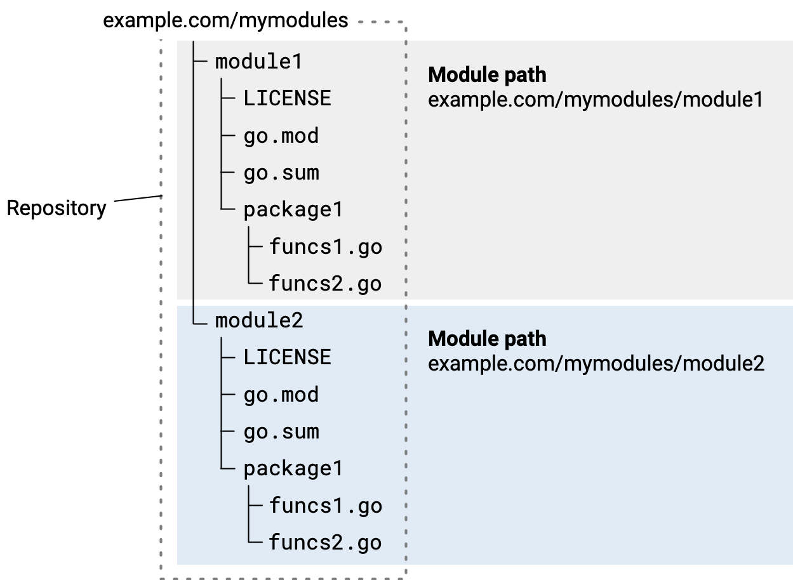

# Essentials

## Session 01

### Structure

Go offer two important principles (module and package) for building scalable and clean project seamlessly.

#### Definition

- **Module:** is a collection of related Go packages. It's a larger unit of code organization introduced with Go Modules
  in version 1.11.
- **Package:** is a way to organize Go source files into reusable units of code.



#### Differences

| **Aspect**   | **Package**                                     | **Module**                           |
|--------------|-------------------------------------------------|--------------------------------------|
| **Scope**    | Organizes individual source files.              | Groups multiple related packages.    |
| **File**     | Declared with `package` keyword in `.go` files. | Managed by the `go.mod` file.        |
| **Purpose**  | Provides code reuse and modularity.             | Manages dependencies and versioning. |
| **Examples** | `fmt`, `math`, or `mathutils`.                  | A project or library with packages.  |

**Note:** It is the best practise to **name** your module with the **repository URL** where the module is hosted. This
ensures uniqueness and avoids naming conflicts, especially when sharing the module with others.

_Example: github.com/username/project_

**Note2:** Go import paths are **case-sensitive**, so **stick to lowercase** letters to avoid issues.

For initialize a module in go you can use following command:

```bash 
go mod init github.com/username/myproject
```

And for using your module in another module you can use this line of code:

```go
import "github.com/username/myproject"
```

#### Main package

The main package in Go is a special package used to define the entry point for an executable program. When you compile
or run a Go program, the compiler looks for the main package and the main() function as the starting point of execution.

**Note:** Every main package must include a main() function and serves as the program's entry point and is executed
first when the program starts.

**Note2:** The main package is not designed to be imported by other packages. It is the top-level package used to run
the application.

##### Use cases:

- Executable Applications: The main package is used when you're building command-line tools, web servers, or any
  executable Go application.
- Testing Programs

```go
package main

import (
	"fmt"
)

func main() {
	fmt.Println("Hello world!")
}
```

#### Run a module

```bash
go run main.go 
```

OR

```bash
go build -o <your_executable_file_name>
```

**Note:** If you skip the -o flag: The output binary will default to the current directory name.

**Note 2:** If a program lacks a main package or a main() function, you will encounter a compilation error:

```txt
go: cannot find main module; see 'go help modules'
```

### Variables

We have two ways for defining a variable in Go:

#### Using the var keyword

```go
var x int
x = 10

// define and initialize in one step
var x int = 10

// infer the type based on the assigned value
var y = 20 // `y` is inferred as `int`

```

#### Using short declaration

```go
z := 30 // `z` is inferred as `int`
```

#### Multiple variable declarations

```go
var a, b, c int

// inferred to same type
var a, b, c = 1, 2, 3

// inferred to different types
x, y, z := 1, "hello", true
```

**Note:** global variables can not be used with `:=` for declaration or initialization

What is global variable: Global variables are declared with var outside of any function

```go
var globalVar = "I'm global!"
```

#### Constants

##### Key features

* **Immutable:** Once defined, constants cannot be reassigned or modified.
* **Compile-Time Value:** Their values must be known at compile time, so you can only assign literals or expressions
  that can be evaluated at compile time.
* **Type Inference:** Constants can have a type explicitly declared or inferred from the value.

```go

// single declaration
const pi = 3.14              // type inferred as `float64`
const language string = "Go" // explicit type declaration

// multiple declaration
const (
a = 42
b = "Hello"
c = true
)

// constant expression violation
const x = 10
var y = 20
// const z = x + y // Error: `y` is a variable

// untyped constants
const x = 42
var y int = x // Works fine
var z float64 = x // Also fine

// constant expressions
const (
a = 5
b = 10
c = a + b // 15
d = a * b // 50
)

// enumerated constants (iota):
const (
First  = iota // 0
Second        // 1
Third         // 2
)

const (
One = iota + 1 // 1
Two            // 2
Four = iota * 2 // 4
)

// 
```

**Note:** For more information, you can read this link: https://www.gopherguides.com/articles/how-to-use-iota-in-golang

#### Types

| **Category**        | **Types**                                                                                                                                                                 |
|---------------------|---------------------------------------------------------------------------------------------------------------------------------------------------------------------------|
| **Basic Types**     | `int`, `uint`, `int8`, `uint8`, `int16`, `uint16`, `int32`, `uint32`, `int64`, `uint64`,`float32`, `float64`, `complex64`, `complex128`, `bool`, `string`, `byte`, `rune` |
| **Composite Types** | `array`, `slice`, `map`, `struct`, `pointer`, `function`                                                                                                                  |
| **Special Types**   | `channel`, `nil`, `interface{}`, `empty interface`                                                                                                                        |

##### Basic types

- Integers
    - Signed
        - int: Platform-dependent size (32 or 64 bits).
        - int8: 8-bit signed integer (-128 to 127).
        - int16: 16-bit signed integer (-32,768 to 32,767).
        - int32: 32-bit signed integer (-2,147,483,648 to 2,147,483,647)
        - int64: 64-bit signed integer (-9,223,372,036,854,775,808 to 9,223,372,036,854,775,807).
    - Unsigned (_an unsigned version of a type can be created by appending 'u' as the first character of the type
      name._)
    - Alias for unsigned integer:
        - byte: Alias for uint8 (commonly used for raw binary data)
        - rune: Alias for int32 (used for unicode code points).
- Float
    - float32: 32-bit floating-point number.
    - float64: 64-bit floating-point number (more precision).
- Boolean
    - bool: true or false.
- String
    - string: Immutable once created (cover more about it in the future.)

**Note:** you can create new types based on existing ones like the following code:

```go
type Celsius float64
```

**Note2:** Alias one type to another for better readability.

```go
type ID = int
```

**Note3:** Differences between custom type and type alias:

| **Aspect**             | **Custom Type**                     | **Type Alias**                        |
|------------------------|-------------------------------------|---------------------------------------|
| **Definition**         | `type NewType ExistingType`         | `type NewName = ExistingType`         |
| **Identity**           | A new, distinct type.               | Same as the original type.            |
| **Interchangeability** | Requires explicit type conversion.  | Fully interchangeable.                |
| **Custom Methods**     | Can define methods on the new type. | Cannot define methods (not distinct). |
| **Use Case**           | Semantic meaning, adding methods.   | Readability, compatibility.           |

---

Here's a concise tutorial on the requested Go topics, complete with examples. You can use this to teach others
effectively.

---

## Session 02

### Input and Output

#### a) Getting Input

In Go, you can use `fmt.Scan` or `fmt.Scanln` to take input from the user. When storing the input into a variable, you
must provide its **memory address** using the `&` symbol. This tells Go where to store the input value.

##### Explanation of `&`:

- The `&` operator is used to get the **address of a variable**.
- `fmt.Scan` and `fmt.Scanln` need a **pointer** to the variable where the input will be stored. By passing the memory
  address using `&`, the functions can directly modify the variable.

#### Example:

```go
package main

import "fmt"

func main() {
	var name string
	fmt.Print("Enter your name: ")
	fmt.Scan(&name) // Use & to pass the address of the variable
	fmt.Println("Hello,", name)
}
```

---

#### b) Printing Output

Go provides several ways to display output using the `fmt` package. Each function serves a specific purpose for
formatting and displaying text.

##### **1) `fmt.Print` and `fmt.Println`**

- **`fmt.Print`**: Prints text **without adding a newline** at the end.
- **`fmt.Println`**: Prints text and **automatically adds a newline** at the end.

##### Example:

```go
package main

import "fmt"

func main() {
	fmt.Print("This is printed without a newline. ")
	fmt.Println("This prints with a newline.")
}
```

##### Output:

```
This is printed without a newline. This prints with a newline.
```

---

##### **2) `fmt.Printf`**

- **`fmt.Printf`**: Prints formatted text, similar to `printf` in C.
- Allows placeholders like `%s` (string), `%d` (integer), `%f` (float), etc.
- A newline (`\n`) must be added manually if needed.

##### Example:

```go
package main

import "fmt"

func main() {
	name := "Alice"
	age := 25
	fmt.Printf("Name: %s, Age: %d\n", name, age)
}
```

##### Output:

```
Name: Alice, Age: 25
```

##### Placeholders:

| Placeholder | Description                 |
|-------------|-----------------------------|
| `%s`        | String                      |
| `%d`        | Decimal (integer)           |
| `%f`        | Floating-point number       |
| `%t`        | Boolean (`true` or `false`) |

---

##### **3) `fmt.Sprintf`**

- **`fmt.Sprintf`**: Similar to `fmt.Printf`, but instead of printing to the console, it **returns the formatted string
  **.
- Useful for storing formatted text in variables.

##### Example:

```go
package main

import "fmt"

func main() {
	name := "Bob"
	message := fmt.Sprintf("Hello, %s!", name) // Store formatted text in a variable
	fmt.Println(message)                       // Print the formatted message
}
```

##### Output:

```
Hello, Bob!
```

---

### Functions

Functions in Go are declared using the `func` keyword. They can take parameters, return values, and optionally name the
return values for clarity.

#### a) Syntax (Unnamed Return Values):

```go
func functionName(param1 type, param2 type) returnType {
// function body
return value
}
```

#### Examples

```go
package main

import "fmt"

// A function that adds two numbers
func add(a int, b int) int {
	return a + b // Explicit return
}

func main() {
	result := add(3, 5)
	fmt.Println("Sum:", result) // Output: Sum: 8
}
```

---

#### b) Syntax (Named Return Values):

```go
func functionName(param1 type, param2 type) (returnValueName returnType) {
// function body
return // implicitly returns the named value
}
```

#### Examples

##### **1) Function with Named Return Value:**

```go
package main

import "fmt"

// A function with a named return value
func add(a int, b int) (result int) {
	result = a + b // Assign to the named return variable
	return         // Implicit return of the named 'result'
}

func main() {
	sum := add(10, 20)
	fmt.Println("Sum:", sum) // Output: Sum: 30
}
```

##### **2) Function with Multiple Named Return Values:**

```go
package main

import "fmt"

// A function to calculate sum and product
func calculate(a int, b int) (sum int, product int) {
	sum = a + b
	product = a * b
	return // Implicitly returns both 'sum' and 'product'
}

func main() {
	s, p := calculate(4, 5)
	fmt.Println("Sum:", s)     // Output: Sum: 9
	fmt.Println("Product:", p) // Output: Product: 20
}
```

#### Key Points:

1. **Unnamed Return Values**:

- Common and straightforward.
- Use when clarity of return values comes from the context or naming of the function.

2. **Named Return Values**:

- Useful for improving readability and reducing explicit code.
- Use for complex functions or when the return values’ purpose is not immediately obvious.

---

### Statements

#### **a) `if`, `else`, and `else if`:**

Go uses these for conditional logic.

#### Example:

```go
package main

import "fmt"

func main() {
	num := 10
	if num > 0 {
		fmt.Println("Positive number")
	} else if num == 0 {
		fmt.Println("Zero")
	} else {
		fmt.Println("Negative number")
	}
}
```

---

#### **b) Loops (`for`):**

Go uses `for` for iteration, and it can replace `while` loops.

##### 1) Simple Loop:

```go
package main

import "fmt"

func main() {
	for i := 1; i <= 5; i++ {
		fmt.Println("Iteration:", i)
	}
}
```

##### 2) `for` as a `while` loop:

```go
package main

import "fmt"

func main() {
	count := 1
	for count <= 5 {
		fmt.Println("Count:", count)
		count++
	}
}
```

##### 3) Breaking a Loop:

```go
package main

import "fmt"

func main() {
	for i := 1; i <= 10; i++ {
		if i == 5 {
			fmt.Println("Breaking the loop at", i)
			break
		}
	}
}
```

##### 4) Continuing a Loop:

```go
package main

import "fmt"

func main() {
	for i := 1; i <= 10; i++ {
		if i%2 == 0 {
			continue // Skip even numbers
		}
		fmt.Println("Odd number:", i)
	}
}
```

---

#### **c) `switch` Case:**

Use `switch` for cleaner multiple condition handling.

#### Example:

```go
package main

import "fmt"

func main() {
	day := 3
	switch day {
	case 1:
		fmt.Println("Monday")
	case 2:
		fmt.Println("Tuesday")
	case 3:
		fmt.Println("Wednesday")
	default:
		fmt.Println("Other day")
	}
}
```

---

## Files

In Go, you can write to files using the os and io/ioutil packages. To write data to a file, you can use the os.WriteFile
function. This function allows you to specify the file path, the data to be written, and the file permissions.
---

#### **a) `Writing To Files` Case:**

The os.WriteFile function is a simple and convenient way to write data to a file. It takes the following parameters:

- path: The file path where the data should be written.
- data: The content you want to write (it must be of type []byte).
- perm: The file permissions, specified using os.FileMode (optional).

#### Syntax:

```go
func WriteFile(name string, data []byte, perm os.FileMode) error
```

#### Example: Writing to a file:

```go
package main

import (
	"fmt"
	"os"
)

func main() {

	content := []byte("Hello, this is a sample text file.\nWelcome to Go programming!")

	os.WriteFile("example.txt", content, 0644)

	fmt.Println("File written successfully!")
}
```

##### File Permission Mode Examples:

| Mode   | Description                                                                 | Readable as |
|--------|-----------------------------------------------------------------------------|-------------|
| `0000` | No permissions (no read, write, or execute).	                               | ---------   |
| `0400` | 	Read-only for owner.                                                       | r--------   |
| `0600` | Read and write for owner.                                                   | rw-------   |
| `0700` | 	Read, write, and execute for owner only.                                   | rwx------   |
| `0644` | Read and write for owner, read-only for others (common for text files).	    | rw-r--r--   |
| `0666` | Read and write for owner, group, and others (common for temporary files).	  | rw-rw-rw-   |
| `0755` | Read, write, and execute for owner, read and execute for group and others.	 | rwxr-xr-x   |
| `0777` | Full permissions (read, write, and execute) for owner, group, and others.	  | rwxrwxrwx   |
| `0750` | Read, write, and execute for owner, and read and execute for group.	        | rwxr-x---   |
| `0711` | Read, write, and execute for owner, and execute-only for group and others.	 | rwx--x--x   |
| `0100` | Execute-only for owner.	                                                    | ---x------  |
| `0111` | Execute-only for owner, group, and others.	                                 | ---x------  |

---

#### **b) `Reading From Files` Case:**

The os.ReadFile function in Go is part of the os package and provides a convenient way to read the contents of a file
into a byte slice ([]byte). It's a simple method for reading entire files, and it automatically handles opening,
reading, and closing the file.

#### Syntax:

```go
func ReadFile(name string) ([]byte, error)
```

- name: The name (path) of the file to read.
- return value: It returns the content of the file as a byte slice ([]byte) and an error if the file can't be read.

#### Example: Reading a File with:

```go
package main

import (
	"fmt"
	"os"
)

func main() {
	data, err := os.ReadFile("example.txt")
	if err != nil {
		fmt.Println("Error reading file:", err)
		return
	}

	fmt.Println("File content:")
	fmt.Println(string(data))
}
```

---

## Error handling

## Error Handling Strategies:

- Error Propagation: When an error occurs, it is passed (propagated) upwards to the caller function, which is
  responsible for handling it. This keeps error handling centralized and makes functions focused on their main tasks.

- Retry on Error: If an error occurs, the program will retry the operation several times before giving up. This is
  useful for operations that might fail temporarily, like network calls or database connections.

- Log and Exit: When a critical error occurs, the program logs the error and then terminates. This is used when
  continuing execution is not possible or meaningful.

- Log and Continue: If an error occurs, it is logged, but the program continues to run. This is useful for non-critical
  errors that don’t stop the application from performing its task.

#### ** `Basic Error Handling with Return Values`**

```go
package main

import (
	"errors"
	"fmt"
)

func divide(a, b int) (int, error) {
	if b == 0 {
		return 0, errors.New("division by zero is not allowed")
		//return 0, fmt.Errorf("cannot divide %d by zero", a)
	}
	return a / b, nil
}

func main() {
	result, err = divide(10, 0)
	if err != nil {
		fmt.Println("Error:", err)
	} else {
		fmt.Println("Result:", result)
	}
}

```

1. Error Propagation
   In this strategy, when an error occurs in a function, the error is propagated (passed) to the calling function. This
   allows each function to focus on its core responsibility and pass the error upwards for handling, without dealing
   with error handling itself.

```go
package main

import (
	"errors"
	"fmt"
)

func divide(a, b int) (int, error) {
	if b == 0 {
		return 0, errors.New("division by zero")
	}
	return a / b, nil
}

func calculate() {
	result, err := divide(10, 0)
	if err != nil {
		fmt.Println("Error in calculate:", err)
		return
	}
	fmt.Println("Result:", result)
}

func main() {
	calculate()
}
```

2. Retry on Error
   This strategy is used when an operation might fail temporarily (like network issues or a database connection), and
   you want to retry the operation a few times before giving up. It makes the program more resilient to transient
   errors.

```go
package main

import (
	"errors"
	"fmt"
	"time"
)

func connectToServer() error {
	return errors.New("server not reachable")
}

func retryConnection(maxRetries int) {
	for i := 1; i <= maxRetries; i++ {
		err := connectToServer()
		if err == nil {
			fmt.Println("Connected to server successfully")
			return
		}
		fmt.Printf("Attempt %d failed, retrying...\n", i)
		time.Sleep(2 * time.Second)
	}
	fmt.Println("Failed to connect after multiple attempts")
}

func main() {
	retryConnection(3)
}
```

3. Log and Exit
   In this strategy, when an error occurs that the program cannot recover from (a critical error), it logs the error and
   then exits. This is useful for errors that make it impossible or illogical to continue running the program.

```go
package main

import (
	"fmt"
	"log"
	"os"
)

func readFile(filename string) (string, error) {
	file, err := os.Open(filename)
	if err != nil {
		return "", err
	}
	defer file.Close()

	var content string
	_, err = fmt.Fscanf(file, "%s", &content)
	if err != nil {
		return "", err
	}

	return content, nil
}

func main() {
	_, err := readFile("nonexistent_file.txt")
	if err != nil {
		log.Fatalf("Error: %v\n", err)
	}
}
```

4. Log and Continue
   In this strategy, when an error occurs, it is logged for later analysis, but the program continues to run. This
   strategy is useful for non-critical errors where the program can still proceed, but you want to keep track of the
   issues.

```go
package main

import (
	"fmt"
	"log"
)

func processItem(item int) error {
	if item%2 == 0 {
		return fmt.Errorf("even number found: %d", item)
	}
	return nil
}

func main() {
	items := []int{1, 2, 3, 4, 5}
	for _, item := range items {
		err := processItem(item)
		if err != nil {
			log.Println("Error:", err)
		} else {
			fmt.Println("Processed:", item)
		}
	}
}
```

## Panic and Recover in Go:

1. Panic
   panic is used to stop the normal flow of a program and immediately terminate the current function. When panic is
   called, the program begins unwinding the call stack (i.e., it returns from the functions it passed through), and
   eventually, if not recovered, the program exits.

2. Recover
   recover is used to regain control of a panicking program. It can only be called from within a defer block. If a panic
   occurs, and recover is called inside the deferred function, it can catch the panic, prevent the program from exiting,
   and allow execution to continue. If recover is not used, the program will terminate.

#### **

` Important Note: If panic occurs outside a defer block, it will cause the program to terminate unless caught with recover.`
**

#### Example: Panic:

```go
package main

import (
	"fmt"
	"os"
)

func loadConfigFile(fileName string) {
	_, err := os.Stat(fileName)
	if err != nil {
		panic(fmt.Sprintf("Critical error: The configuration file '%s' is missing or invalid!", fileName))
	}

	fmt.Println("Configuration file loaded successfully.")
}

func main() {
	loadConfigFile("config.json")

	fmt.Println("Server is starting...")
}

```

#### Example: Panic and Recover:

```go
package main

import "fmt"

func riskyFunction() {
	panic("Something went terribly wrong!")
}

func safeFunction() {
	defer func() {
		if r := recover(); r != nil {
			fmt.Println("Recovered from panic:", r)
		}
	}()

	riskyFunction()
	fmt.Println("This line will not be executed if panic happens")
}

func main() {
	safeFunction()
	fmt.Println("Program continues after recovery")
}

```