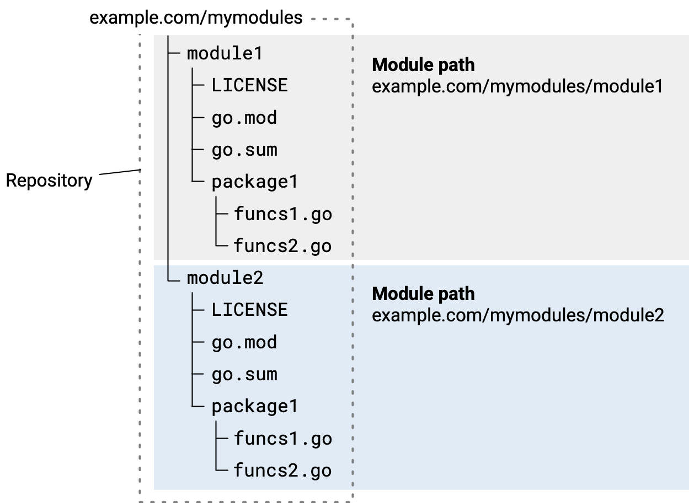

# Essentials


### Structure
Go offer two important principles (module and package) for building scalable and clean project seamlessly.

#### Definition

- **Module:** is a collection of related Go packages. It's a larger unit of code organization introduced with Go Modules in version 1.11.
- **Package:** is a way to organize Go source files into reusable units of code.



#### Differences

| **Aspect**       | **Package**                                     | **Module**                              |
|------------------|-------------------------------------------------|-----------------------------------------|
| **Scope**        | Organizes individual source files.              | Groups multiple related packages.       |
| **File**         | Declared with `package` keyword in `.go` files. | Managed by the `go.mod` file.           |
| **Purpose**      | Provides code reuse and modularity.             | Manages dependencies and versioning.    |
| **Examples**     | `fmt`, `math`, or `mathutils`.                  | A project or library with packages.     |

**Note:** It is the best practise to **name** your module with the **repository URL** where the module is hosted. This ensures uniqueness and avoids naming conflicts, especially when sharing the module with others.

_Example: github.com/username/project_


**Note2:** Go import paths are **case-sensitive**, so **stick to lowercase** letters to avoid issues.


For initialize a module in go you can use following command:
```bash 
go mod init github.com/username/myproject
```

And for using your module in another module you can use this line of code:
```go
import "github.com/username/myproject"
```


#### Main package

The main package in Go is a special package used to define the entry point for an executable program. When you compile or run a Go program, the compiler looks for the main package and the main() function as the starting point of execution.

**Note:** Every main package must include a main() function and serves as the program's entry point and is executed first when the program starts.

**Note2:** The main package is not designed to be imported by other packages. It is the top-level package used to run the application.

##### Use cases:

- Executable Applications: The main package is used when you're building command-line tools, web servers, or any executable Go application.
- Testing Programs

```go
package main

import (
	"fmt"
)

func main() {
	fmt.Println("Hello world!")
}
```

#### Run a module

```bash
go run main.go 
```
OR
```bash
go build -o <your_executable_file_name>
```
**Note:** If you skip the -o flag: The output binary will default to the current directory name.

**Note 2:** If a program lacks a main package or a main() function, you will encounter a compilation error:

```txt
go: cannot find main module; see 'go help modules'
```

### Variables

We have two ways for defining a variable in Go:

#### Using the var keyword

```go
var x int
x = 10

// define and initialize in one step
var x int = 10

// infer the type based on the assigned value
var y = 20 // `y` is inferred as `int`

```

#### Using short declaration

```go
z := 30 // `z` is inferred as `int`
```
        

#### Multiple variable declarations

```go
var a, b, c int

// inferred to same type
var a, b, c = 1, 2, 3

// inferred to different types
x, y, z := 1, "hello", true
```

**Note:** global variables can not be used with `:=` for declaration or initialization

What is global variable: Global variables are declared with var outside of any function
```go
var globalVar = "I'm global!"
```

#### Constants

##### Key features
* **Immutable:** Once defined, constants cannot be reassigned or modified.
* **Compile-Time Value:** Their values must be known at compile time, so you can only assign literals or expressions that can be evaluated at compile time.
* **Type Inference:** Constants can have a type explicitly declared or inferred from the value.

```go

// single declaration
const pi = 3.14          // type inferred as `float64`
const language string = "Go" // explicit type declaration

// multiple declaration
const (
a = 42
b = "Hello"
c = true
)

// constant expression violation
const x = 10
var y = 20
// const z = x + y // Error: `y` is a variable

// untyped constants
const x = 42
var y int = x  // Works fine
var z float64 = x // Also fine


// constant expressions
const (
a = 5
b = 10
c = a + b // 15
d = a * b // 50
)


// enumerated constants (iota):
const (
First  = iota // 0
Second        // 1
Third         // 2
)

const (
One = iota + 1 // 1
Two            // 2
Four = iota * 2 // 4
)

// 
```

**Note:** For more information, you can read this link: https://www.gopherguides.com/articles/how-to-use-iota-in-golang

#### Types

| **Category**         | **Types**                                                                                                                                                                 |
|----------------------|---------------------------------------------------------------------------------------------------------------------------------------------------------------------------|
| **Basic Types**      | `int`, `uint`, `int8`, `uint8`, `int16`, `uint16`, `int32`, `uint32`, `int64`, `uint64`,`float32`, `float64`, `complex64`, `complex128`, `bool`, `string`, `byte`, `rune` |
| **Composite Types**  | `array`, `slice`, `map`, `struct`, `pointer`, `function`                                                                                                                  |
| **Special Types**    | `channel`, `nil`, `interface{}`, `empty interface`                                                                                                                        |

##### Basic types

- Integers
  - Signed
    - int: Platform-dependent size (32 or 64 bits).
    - int8: 8-bit signed integer (-128 to 127).
    - int16: 16-bit signed integer (-32,768 to 32,767).
    - int32: 32-bit signed integer (-2,147,483,648 to 2,147,483,647)
    - int64: 64-bit signed integer (-9,223,372,036,854,775,808 to 9,223,372,036,854,775,807).
  - Unsigned (_an unsigned version of a type can be created by appending 'u' as the first character of the type name._)
  - Alias for unsigned integer:
    - byte: Alias for uint8 (commonly used for raw binary data)
    - rune: Alias for int32 (used for unicode code points).
- Float
  - float32: 32-bit floating-point number.
  - float64: 64-bit floating-point number (more precision).
- Boolean
  - bool: true or false.
- String
  - string: Immutable once created (cover more about it in the future.)


**Note:** you can create new types based on existing ones like the following code:
```go
type Celsius float64
```

**Note2:** Alias one type to another for better readability.
```go
type ID = int
```

**Note3:** Differences between custom type and type alias:

| **Aspect**             | **Custom Type**                       | **Type Alias**                        |
|------------------------|---------------------------------------|---------------------------------------|
| **Definition**         | `type NewType ExistingType`           | `type NewName = ExistingType`         |
| **Identity**           | A new, distinct type.                 | Same as the original type.            |
| **Interchangeability** | Requires explicit type conversion.    | Fully interchangeable.                |
| **Custom Methods**     | Can define methods on the new type.   | Cannot define methods (not distinct). |
| **Use Case**           | Semantic meaning, adding methods.     | Readability, compatibility.           |


